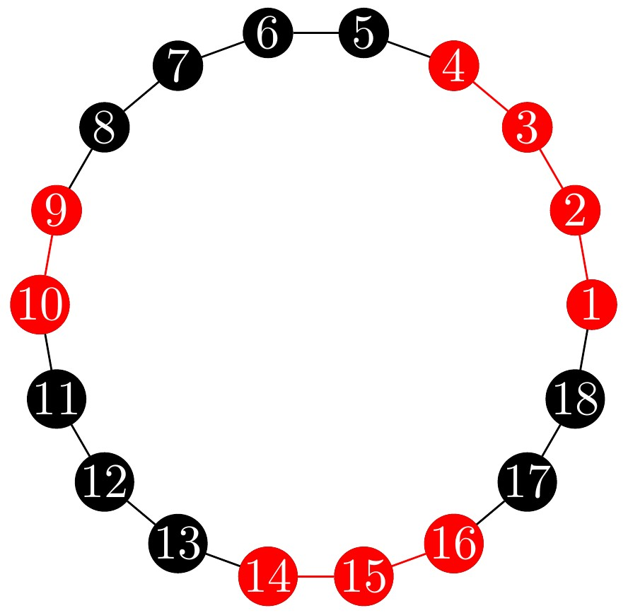

<!-- 
 
  

 -->
<h1 align="center"> Synchronous/Asynchronous Cooridinating/Anticooridinating Cellular Automata </h1>
<h3 align="center"> COMP 1740357 - Internship </h3>
<h5 align="center"> Internship Report - <a href="https://english.iut.ac.ir/">Isfahan University of Technology</a> (Winter & Spring 2023) </h5>

 
  

<!-- TABLE OF CONTENTS -->
<h2 id="table-of-contents"> 📖 Table of Contents</h2>

  
Table of Contents

  <ol>
    <li><a href="#about-the-problem"> ➤ About The Problem</a></li>
    <li><a href="#project-files-and-folders-description"> ➤ Project Files and Folders Description</a></li>
    <li><a href="#our-approach"> ➤ Our Approach</a></li>
    <li><a href="#references"> ➤ References</a></li>
    <li><a href="#credits"> ➤ Credits</a></li>
  </ol>

<!-- ABOUT THE PROJECT -->
<h2 id="about-the-problem"> 📝 About The Problem</h2>

Consider $n$ agents on a ring, labeled by $1,\ldots, n$. 
Each agent plays either of the strategies $A$ or $B$ over time $t=0,1,\ldots$.
At each time $t$, a single agent becomes active to update its strategy; If its strategy is different from those of its neighbors, she is equilibrium; otherwise, she switches.
The activation of the agents follows a stochastic process, determined by the i.i.d. multinomial random variables $I_0,I_1,\ldots\in\{1,\ldots,n\}$ with mean $p$, where $I_t$ is the active agent at time $t$.
We are interested in finding the expected time until the network reaches an equilibrium.

<!-- PROJECT FILES DESCRIPTION -->
<h2 id="project-files-and-folders-description"> 💾 Project Files and Folders Description</h2>

<ul>
  <li><b>📁code</b> - Where the implementation the code of our third approach resides.</li>
  <li><b>📁notes</b> - Includes the main.pdf file which the details of our approaches are documented. It also includes a "Draft & Notes" folder in which drafts and other temporary documents reside.</li>
  <li><b>📁pic</b> - Where the images used in documents reside.</li>
  <li><b>📁related papers</b> - Includes the mentioned papers reside.</li>
</ul>

<!-- <h3>Some other supporting files</h3>
<ul>
  <li><b>graphicsDisplay.py</b> - Graphics for Pacman.</li>
</ul> -->

<!-- GETTING STARTED -->
<!-- <h2 id="getting-started"> 📖 Getting Started</h2>

You are able to start the game by typing the following commands in the command line:

<pre><code>$ python pacman.py</code></pre>

You can see the list of all options and their default values via:

<pre><code>$ python pacman.py -h</code></pre>
<i>Note that all of the commands that appear in this project also appear in <code>commands.txt</code>, for easy copying and pasting.</i>

 -->

<!-- OUR APPROACH -->
<h2 id="our-approach"> 💡 Our Approach</h2>

In our pursuit of proving the polynomial nature of the expected relaxation time concerning the number of agents, denoted as $n$ we embarked on three primary approaches to substantiate this assertion. Regrettably, all of these endeavors ultimately met with failure.

  1. Potential Function Analysis:
    Our initial approach drew inspiration from the concept presented in [1]. We sought to establish a potential function, akin to the one delineated in [1], and endeavored to leverage "the probability of reaching equilibrium in the next step ($p$)" to derive an upper bound for the expected difference in the potential function across consecutive steps. Unfortunately, contrary to the configuration outlined in [1], there exists a scenario in which '$p$' can be zero. Consequently, this endeavor proved unsuccessful.

  2. Markov Chain Modeling:
    In our second approach, we endeavored to model the problem as a Markov chain, with the aim of determining the expected hitting time for each state within our configuration. However, we encountered a significant challenge in adapting this approach to the synchronous version of the problem. Unlike the asynchronous version, where the random walker's possible next states are more manageable, the synchronous version presents a daunting multitude of potential states for the random walker's next move. As a result, the analysis of the problem using this approach became excessively complex and challenging to pursue. Consequently, this approach also proved unsuccessful.

  3. Double-Quiescent Elementary Cellular Automata (DQECA):
    Our third approach drew upon concepts introduced in [2], specifically those related to "Double-quiescent Elementary Cellular Automata." Our problem's configuration bore a resemblance to the DQECA designated as 'ABCFGH' in [2]. To explore this avenue, we implemented a code designed to compute the expected difference in the occurrences of a specified list of patterns in the subsequent iteration. Our hope was that these computed values would consistently exhibit non-positivity across all binary strings with a length equal to that of the longest pattern plus two. Unfortunately, this approach also fell short of our expectations, as certain strings exhibited positive expectations. 
    
  For additional details regarding the mentioned approaches and our implemented code, please consult the "main.pdf" and "final.ipynb" file located in the "notes" and "code" folders of this repository respectively.

<!-- REFERENCES -->
<h2 id="references"> 🌏 References</h2>

[1]
Proving a phase transition in cellular automata under asynchronous dynamics, Damien Regnault, 2012

[2] Fatès, N., Regnault, D., Schabanel, N., Thierry, É. (2006). Asynchronous Behavior of Double-Quiescent Elementary Cellular Automata. In: Correa, J.R., Hevia, A., Kiwi, M. (eds) LATIN 2006: Theoretical Informatics. LATIN 2006. Lecture Notes in Computer Science, vol 3887. Springer, Berlin, Heidelberg. https://doi.org/10.1007/11682462_43

<!-- CREDITS -->
<h2 id="credits"> 📜 Credits</h2>
<a href="https://brocku.ca/mathematics-science/mathematics/directory/pouria-ramazi/">Prof. Pouria Ramazi</a>, Brock University

Alireza Abrehforoush

<!-- Acknowledgements: Based on UC Berkeley's Pacman AI project, <a href="http://ai.berkeley.edu">http://ai.berkeley.edu</a> -->

